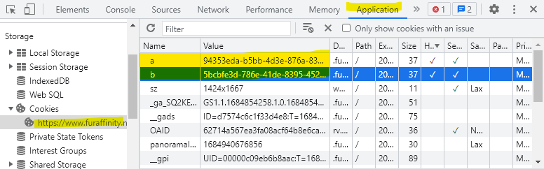

# Furry site favorite scraper

This is a simple script that scrapes your favorites from furry sites and stores them in a local FileSystem. Submission metadata is stored into the MongoDB database.

## Supported sites

- [x] Inkbunny
- [x] FurAffinity

## Installation

Before installing, make sure your MongoDB server is running.

### Using MongoDB Atlas

Visit [https://www.mongodb.com/atlas/database](https://www.mongodb.com/atlas/database) and create your Database

Copy connection string into the `config.toml` file. See `config.toml.example` for example.

```toml
[db]
mongodb = "mongodb+srv://<username>:<password>@my-serverlessinst.mongodb.net/"
dbname = "scrapbook"
```


### Initializing the database

To create Index, run this command

```bash
npm install
node init-db.js
```

## Usage

### Common

1. Create a file named `config.toml` in the root directory of this project.
2. Copy the contents of `config.toml.example` into `config.toml`.
3. Edit `[db]` section of `config.toml`
   - `mongodb`: Your MongoDB connection string
   - `dbname`: Your MongoDB database name
4. Edit `[files]` section of `config.toml`
   - `dir`: The root directory to store your files

### Inkbunny

#### Configuration

Edit `[ib]` section of `config.toml`

- `username`: Your IB username
- `password`: Your IB password

### Running

```bash
node ib-fav-fetch.js
```

### FurAffinity

#### Configuration

Edit `[fa]` section of `config.toml`

- `username`: Your FA username
- `cookie`: Your FA cookie
  - You can get this by logging into FA, opening the developer tools, and copying the value of the `a` and `b` cookie.
  - 

#### Running

```bash
node fa-fav-fetch.js
```

### Bulk create thumbnails

You can create missing thumbnails by running this command

```bash
node create-thumbnail.js
```

You do not have to run this command separatly. Thumbnail creation process is already embedded into the fetcher.

## License

MIT
